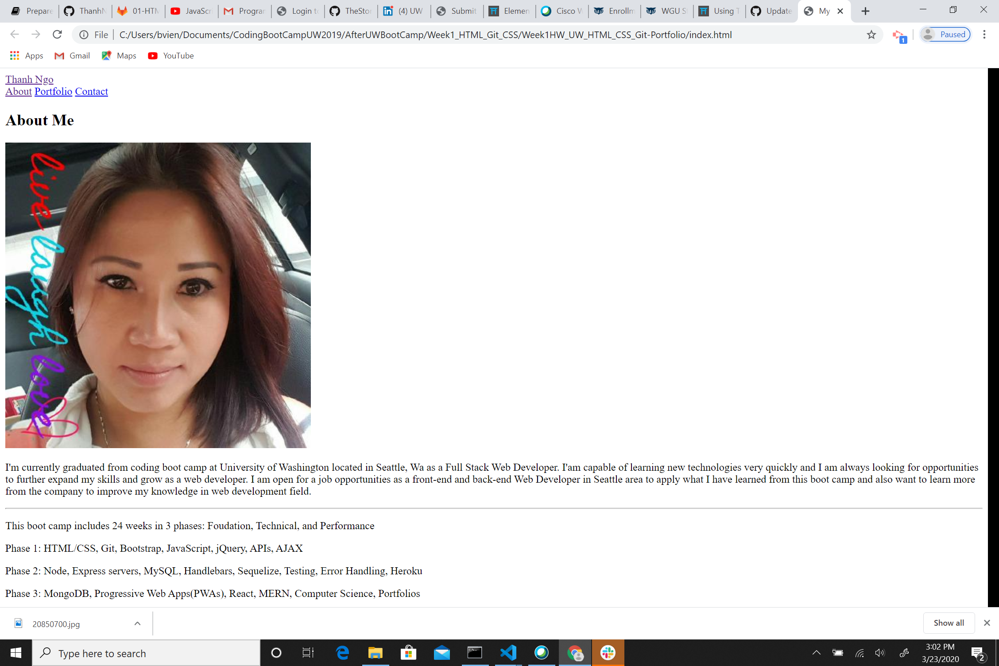
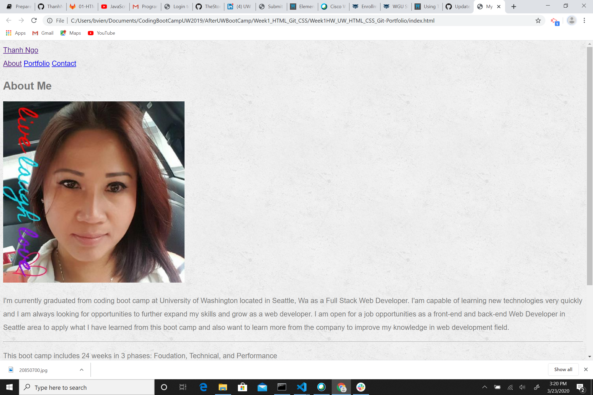

# Week1HW_UW_HTML_CSS_Git-Portfolio
As a web developer, I want a deployed portfolio, so that I can showcase my applications to potential employers and clients.
====================================================
# uncomment the below to see step by step process images
<!--  -->
<!--  -->
<!-- [image's css](assets/images/imageCSS.png) -->
<!-- [general CSS settings](assets/images/genralCSSsetting.png) -->